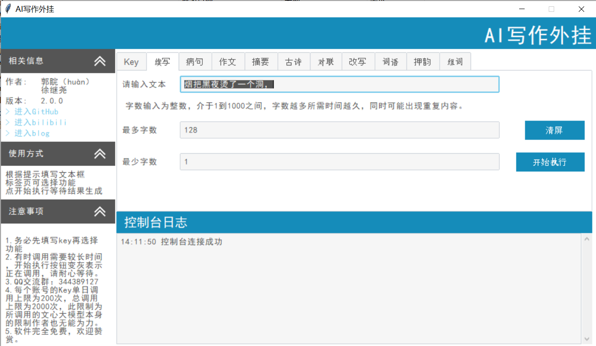

# AI写作外挂

## 软件截图



## 方案背景

服务于所有与文字打交道的人。

中小学生常常受到写作文不知道从何下手的困扰，此软件可以提供作文生成。或者写到一半灵感枯竭，凑不够字数，此软件可以续写。学习过程中难免出现病句，此软件提供病句改错功能。

新闻工作者常常需要提取摘要，此软件可以提供摘要生成参考。

古诗对联爱好者，需要大量的灵感，此软件提供妙手偶得之的途径。

写论文最让人头疼的就是查重，同义改写为论文降重提供可能。

文章由句子组成，句子由字词组成，提供字词，供写作者使用。

## 运行方式

### 编程环境

`python` 版本 `3.9.1`	

`qgui `版本 `0.6.3`

`wenxin_api`版本 `0.0.2`

### 安装依赖

```
pip install qgui
pip install wenxin_api==0.0.2
```

其他用到的库：`requests`，`json`，`webbrowser`，`os`

### 运行源码

```
python AI_writing_helper.py
```

## 打包软件

### 编程环境

`pyinstaller` 版本 5.2

### 安装依赖

```
pip install pyinstaller
```

### 注意事项

直接打包，运行打包后的软件出现类似以下问题：


找不到 `double_down.png`，给的是一个很长的temp路径不存在。（原问题错误没有截屏，和这个错误就最后一行不一样）

问题出在 `tkinter` 找不到图片，我的解决方案是，将 `double_down.png` 和 `double_up.png` 两个图片的路径改为软件的相对路径，软件同级目录加一个 `images` 文件夹。

同样需要 `qgui` 本身的代码，在 `qgui\third_party\collapsing_frame.py` 文件第 27 到 30 行，改为如下：

```python
        self.images = [tkinter.PhotoImage(name='open',
                                          file="images/double_down.png"),
                       tkinter.PhotoImage(name='closed',
                                          file="images/double_up.png")]
```

可以手动更改，可以直接用我放在 `qgui\third_party\collapsing_frame.py` 的文件。

如果不想更改的话，不影响源码的执行，打包时候可能报错。

`wenxin_api` `0.1.2`版本打包后运行会报错，找不到一个文件，但是正常用源码运行不影响，作者目前仍然是使用的`0.0.2`版本

### 打包命令

```
pyinstaller -F -w -i AI写作外挂.ico AI_writing_helper.py --collect-all ttkbootstrap
```

### 软件发行

将 `AI_writing_helper.exe` 更名为 `AI写作外挂.exe`

再将 `AI写作外挂.exe` 与 `images` 文件夹一同压缩为 `AI写作外挂.zip`

软件运行时必须保证，`AI写作外挂.exe` 与`images` 文件夹同级，不可单独移动其一。

## 开发团队

`1.x` 版本为 郭睆 一人

`2.x` 版本 徐继尧 加入