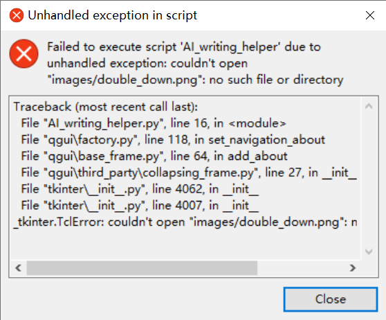

# AI写作外挂

[](https://www.orcarouter.ai/ref/ref_b183ab1e01f1ab2c8e0e)

## 软件截图


## 方案背景

服务于所有与文字打交道的人。

中小学生常常受到写作文不知道从何下手的困扰，此软件可以提供作文生成。或者写到一半灵感枯竭，凑不够字数，此软件可以续写。学习过程中难免出现病句，此软件提供病句改错功能。

新闻工作者常常需要提取摘要，此软件可以提供摘要生成参考。

古诗对联爱好者，需要大量的灵感，此软件提供妙手偶得之的途径。

写论文最让人头疼的就是查重，同义改写为论文降重提供可能。

文章由句子组成，句子由字词组成，提供字词，供写作者使用。

## 模型服务：OrcaRouter

本软件通过 [OrcaRouter](https://www.orcarouter.ai/ref/ref_b183ab1e01f1ab2c8e0e) 的 OpenAI 兼容接口调用大模型：一个 API 接入所有主流模型，内置自适应路由与故障转移，支持自带密钥（BYOK），按官方价格计费、零加价。通过推荐链接注册，本项目维护者将获得所推荐工作区后续消费额 5% 的返利。

## 运行方式

### 编程环境

`python` 版本 `3.9.1`	

`qgui `版本 `0.6.3`

### 安装依赖

```
pip install qgui
pip install requests
```

### 获取 API Key

1. 点击[推荐链接](https://www.orcarouter.ai/ref/ref_b183ab1e01f1ab2c8e0e)注册并登录 OrcaRouter。
2. 进入[控制台](https://www.orcarouter.ai/console)创建 API Key（`sk-orca-` 开头）。
3. 运行软件，在 `Key` 页填入 API Key，点击“保存key”。

模型默认 `orcarouter/auto`（OrcaRouter 按请求难度自动选择），也可在 `模型` 输入框填写 `qwen/qwen3-max`、`z-ai/glm-5`、`kimi/kimi-k2.5` 等目录内的任意模型。

### 运行源码

```
python AI_writing_helper.py
```

## 打包软件

### 编程环境

`pyinstaller` 版本 5.2

### 安装依赖

```
pip install pyinstaller
```

### 注意事项

直接打包，运行打包后的软件出现类似以下问题：



找不到 `double_down.png`，给的是一个很长的temp路径不存在。（原问题错误没有截屏，和这个错误就最后一行不一样）

问题出在 `tkinter` 找不到图片，我的解决方案是，将 `double_down.png` 和 `double_up.png` 两个图片的路径改为软件的相对路径，软件同级目录加一个 `images` 文件夹。

同样需要 `qgui` 本身的代码，在 `qgui\third_party\collapsing_frame.py` 文件第 27 到 30 行，改为如下：

```python
        self.images = [tkinter.PhotoImage(name='open',
                                          file="images/double_down.png"),
                       tkinter.PhotoImage(name='closed',
                                          file="images/double_up.png")]
```

可以手动更改，可以直接用我放在 `qgui\third_party\collapsing_frame.py` 的文件。

如果不想更改的话，不影响源码的执行，打包时候可能报错。

### 打包命令

```
pyinstaller -F -w -i AI写作外挂.ico AI_writing_helper.py --collect-all ttkbootstrap
```

### 软件发行

将 `AI_writing_helper.exe` 更名为 `AI写作外挂.exe`

再将 `AI写作外挂.exe` 与 `images` 文件夹一同压缩为 `AI写作外挂.zip`

软件运行时必须保证，`AI写作外挂.exe` 与`images` 文件夹同级，不可单独移动其一。

## 开发团队

`1.x` 版本为 郭睆 一人

`2.x` 版本 徐继尧 加入
